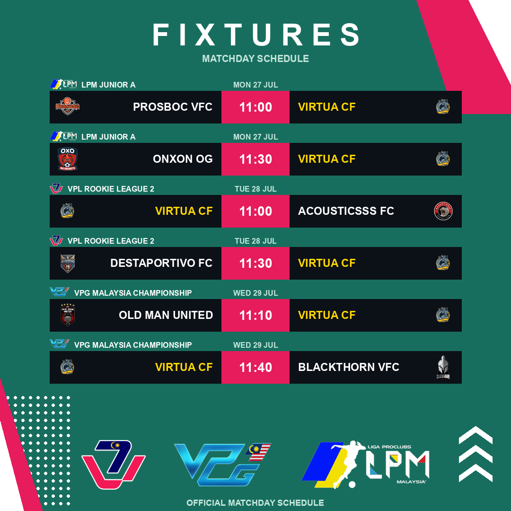

# ⚽ Pro Clubs Malaysia Matchday Schedule Tracker & Poster Generator

[](https://github.com/tariq951/proclubs-tracker/releases)
[](LICENSE)
[](https://www.python.org/)

An automated matchday schedule tracking pipeline, graphic poster generator, and Discord bot for **Virtua CF** across **VPL Malaysia**, **VPG Malaysia**, and **LPM Malaysia**.

---

## 🌟 Key Features

- 🇲🇾 **Multi-Platform Web Scraping**: Fetches upcoming fixtures in parallel across VPL Malaysia, LPM Malaysia, and VPG REST API.
- 🎨 **Kickly-Style Graphic Poster**: Renders a high-resolution 1080x1080 matchday poster matching Virtua CF's official brand identity (**Midnight Navy** `#0b1723` & **Electric Gold** `#f4ba1d`).
- ✂️ **Smart Corner Floodfill Logo Processing**: 
  - Uses Pillow's `ImageDraw.floodfill()` starting from 4 corners (`thresh=30`) to remove contiguous outer white backgrounds while preserving internal white text/stripes.
  - Applies `getchannel('A').getbbox()` alpha trimming before aspect-ratio scaling to fixed target bounding boxes.
- 🗓️ **Dynamic Matchweek Counter**: Calculates and displays current season matchweeks (e.g. `MATCHWEEK 03`) dynamically from the 13/07/2026 season start date.
- 🤖 **Discord Bot & Slash Commands**:
  - `/schedule`: Displays both the day-grouped text schedule embed and the matchday poster graphic.
  - `/poster`: Displays ONLY the graphic matchday poster image.

---

## 📸 Matchday Poster Preview



---

## 🚀 Quick Start Guide

### 1. Prerequisites & Installation

Clone the repository and set up a virtual environment:

```bash
git clone https://github.com/tariq951/proclubs-tracker.git
cd proclubs-tracker

# Create and activate virtual environment
python3 -m venv venv
source venv/bin/activate  # On Windows: venv\Scripts\activate

# Install dependencies
pip install -r requirements.txt
```

---

### 2. Configuration (`.env`)

Create or update your `.env` file in the root directory:

```env
CLUB_NAME=Virtua CF
DISCORD_WEBHOOK_URL=https://discord.com/api/webhooks/your_webhook_url
DISCORD_BOT_TOKEN=your_discord_bot_token
```

---

### 3. Running the Schedule Tracker & Poster Generator

Run the main pipeline:

```bash
python main.py
```

#### What Happens Automatically:
1. **Scrapes Fixtures**: Connects to VPL, VPG, and LPM in parallel.
2. **Filters Matchday Window**:
   - Mon – Wed: Generates schedule for **Current Week**.
   - Thu – Sun: Shifts to **Next Week**.
3. **Caches Crests & Trims Padding**: Applies corner floodfill background removal and alpha trimming.
4. **Renders Poster**: Outputs `matchday_poster.png` (1080x1080 resolution).
5. **Notifies Discord**: Posts embeds and poster payload to your Discord Webhook.

---

### 4. Running the Discord Bot

To run the interactive slash command bot:

```bash
python bot.py
```

#### Available Slash Commands:
- `/schedule`: Posts day-grouped fixture list and matchday poster graphic.
- `/poster`: Posts ONLY the graphic matchday poster image.

---

## 📜 Changelog

See detailed version history and updates in [CHANGELOG.md](CHANGELOG.md).

---

## 📄 License

Distributed under the MIT License. See [LICENSE](LICENSE) for more details.
